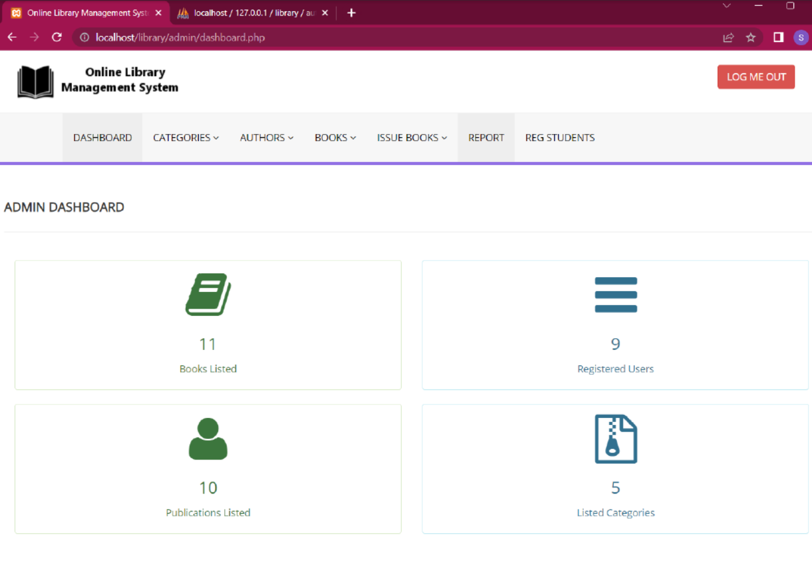

# Library Management System

## Overview

The Library Management System is a comprehensive software solution that efficiently manages library operations, catering to both administrators/library staff and users. It simplifies the process of book management, user registration, lending, returning, reporting, and more. Below, you'll find an overview of the system's key functionalities for administrators/library staff and users.

## Tech Stack

- **Frontend**:
  - HTML
  - CSS
  - JavaScript

- **Backend**:
  - PHP

- **Database**:
  - MySQL

- **Server**:
  - XAMPP

## Administrator/Library Staff Menu

### Book Management

- **Insert, Modify, and Delete Books**: Administrators can add new books to the library catalog, update existing book details, and remove books that are no longer in circulation.

### Category Management

- **Insert, Modify, and Delete Categories**: Administrators can categorize books based on genres, subjects, or any other classification criteria. They can also update category information and remove categories as needed.

### Author Management

- **Insert, Modify, and Delete Authors**: Administrators can maintain a database of authors associated with the books in the library. They can add new authors, edit author details, and remove author records when necessary.

### User Management

- **User Registration**: Administrators can enroll new library users, ensuring they adhere to the library's policies and guidelines.

### Book Borrowing

- **Lend a Book**: Administrators can issue books to library users, allowing them to borrow the desired books for a specified period.

- **Return a Book**: Administrators can process book returns, updating the status of books and making them available for other users.

### Reporting

- **User-wise Reports**: Generate and print user-wise reports, providing insights into each user's borrowing history and library activities.

### User Blocking

- **Block a User**: Administrators have the authority to block users who violate library policies or have overdue books.

## User Menu

### User Registration and Authentication

- **Log In and Sign Up**: Users can create accounts and log in using their credentials, enabling them to access the library's services.

### Status Viewing

- **View Status**: Users can check their account status, including details about borrowed books, due dates, and any fines or penalties.

### Book Tracking

- **Track Unreturned Books**: Users can monitor the books they have borrowed and their return status, helping them stay organized and responsible.

## Getting Started

To set up the Library Management System on your system, follow these steps:

1. **Clone the Repository**: Clone the system's repository to your local machine.

2. **Database Setup**: Set up the required database to store book, user, and transaction data. Import the database schema provided with the system.

3. **Configuration**: Configure the system to connect to the database and define administrator credentials.

4. **Run the Application**: Launch the application, and you'll be able to access the administrator/library staff and user menus.

## Thank You for Using the Library Management System!

We hope this software simplifies your library operations, providing a seamless experience for both administrators and users. If you have any questions, encounter issues, or would like to contribute to the development of this system, please feel free to reach out. Happy library management!

